# 行为预测数据分析

## Todo
- [x] 单时间步，label是下次刷卡地点
- [ ] 学生分组到时间步训练，label是当前刷卡地点
- [ ] 学生分组到时间步训练，label是下次刷卡地点
- [ ] 修改网络主体结构
- [ ] keras重构网络结构
- [ ] 样本不均衡：降采样
- [ ] 样本不均衡：权重
- [x] 样本不均衡：Focal loss
- [x] 研究意义说明

## 初版实验-LSTM预测地点

### 数据情况
暂时使用刷卡数据，进行数据清洗过程。数据没有NA条目。
每类特征的唯一值数量：
```js
col name: student_id - 41633
col name: card_id - 62582
col name: amount - 13834
col name: remained_amount - 179368
col name: trans_type - 38
col name: category - 10
col name: device_id - 3470
col name: device_name - 12
col name: campus - 1
col name: timeslot - 7
col name: place0 - 104
```
- 刷卡地点:刷卡地点通过过滤，以建筑为单位过滤结果，获取了104个地点
- 校区：为了提升精度，可以考虑将校区映射关系提取出来
- 时间：利用刷卡数据，将时间映射成时间区间timeslot，按学生平日上下课来区分：
```js
sleep 0:0 6:45
breakfast 6:45 8:30
morning 8:30 11:55
noon 11:55 14:30
afternoon 14:30 17:55
dinner 17:55
night 19:30
sleep 21:55
```
因为deviceId和deviceName会泄露地点，所以特征输入时没有利用这两列。
最后的特征输入如图：

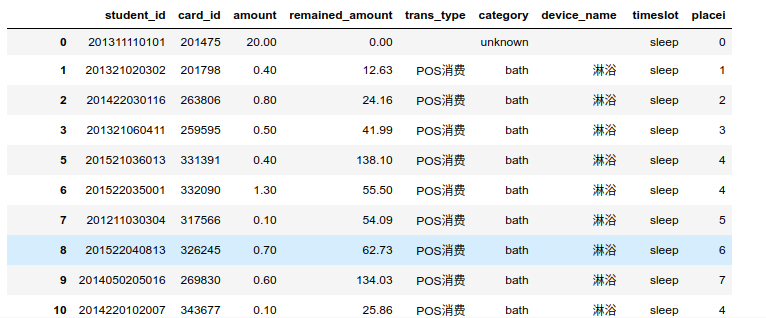

总数据条目：17827913，其中切分为训练集70%、验证集15%、测试集15%、

### 特征构造

利用tensorflow自带的tf.feature_column工具可以方便的将各类特征映射为tensor，除金额外，其他的特征都映射为了类别特征。

可以看出有很多列的唯一值太多，对超过1000个的categorical特征，我们将其embedding为100维的向量，保证特征数量不会太大。其中student_id，card_id被映射。

### Label
标签为清洗后的地点数据，总共有104个地点，精确到楼栋，

#### Label imbalance
样本数查看后发现标签十分不均衡，考虑训练中利用带权样本处理的方式来训练。
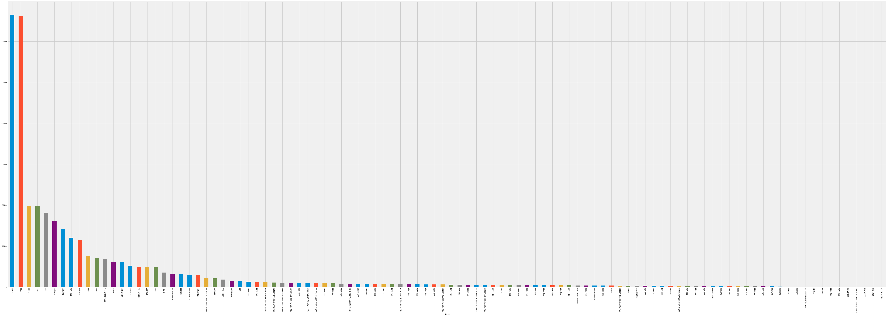

### 网络结构

主体网络是一个4层的单向LSTM，每层向量长度为：[1000, 500, 150, 104]，最后一层输出即地点输出。训练用dynamic_rnn连接，时间步为1

loss函数为交叉熵，利用tf.nn.sparse_softmax_cross_entropy_with_logits评价

### 评价指标
accuracy最高可达0.17左右，此时train step在19k左右：
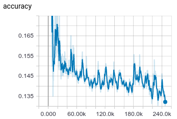

其中loss变化如下，可以看出loss在22.5kstep时达到最低，往后过拟合
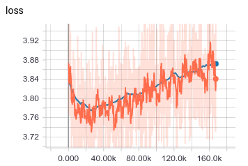


## 第二次实验-修改损失为focal loss
数据和样本与第一次实验相同
### Focal loss
Focal loss主要是为了解决one-stage目标检测中正负样本比例严重失衡的问题。该损失函数降低了大量简单负样本在训练中所占的权重，也可理解为一种困难样本挖掘。
二分类的交叉熵的表达式为：
$$L=-ylogy'-(1-y)log(1-y')$$
其中$y$和$y'$分别是label和网络的输出logits
focal loss在交叉熵的基础上添加了两个参数$\gamma$和$\alpha$，其中$\gamma$保证错分样本损失更高，$\alpha$保证样本balance，此处可以发现focal loss是在二分类中使用的一种损失函数，并不适合多分类。
公式如下：
$$FL(p_t)=-\alpha(1-p_t)^\gammalog(p_t)$$

### 结果

精确度：    


损失：  
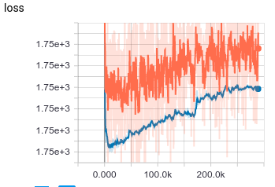

top@1:  
这个指标应该和精确度一致，但实际计算通过tf.metrics.mean封装，可能会导致计算结果为整体batch平均top@k值
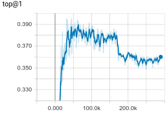

top@3:  
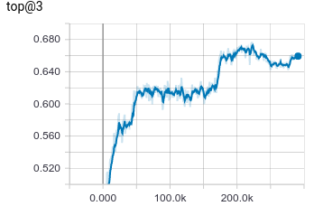

top@5:  
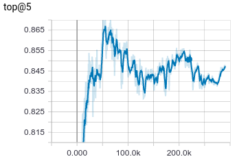

top@10:     
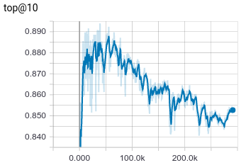


## 第三次实验-focal loss预测上次地点
通过某次刷卡数据预测学生上次在哪里刷卡，因为代码误写导致计算了这个实验
数据：消费数据，按时间排序，对每个学号的学生，将当前的标签替换为上次刷卡的时间；
特征与之前的实验相同；网络结果与前两次实验相同

### 结果
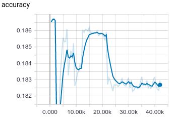
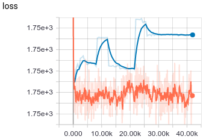
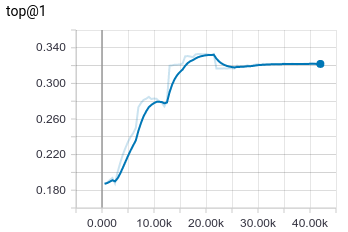
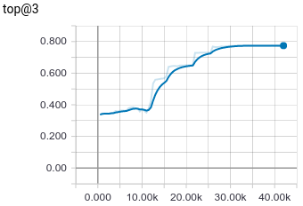
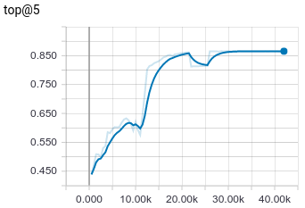
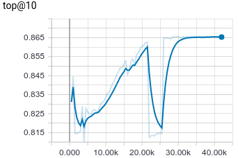

通过计算结果来看，loss在验证集（蓝色曲线）上最开始最低，后面越来越高；accuracy有奇怪的抖动。最高accuracy在最初时最高，约0.186，往后越来越低。

## 第四次实验-将输入数据按学号Groupby
前期数据输入并没有考虑数据的时序性，导致lstm网络主要功能并没有好好发挥出来，本次通过将输入数据按学号分组，每组数据表示一个学生的整体刷卡情况，输入到网络中，以此来计算学生的活动情况

### 进度
对学生数据的转换比较复杂：
- 利用numpy数组输入导致错误，原因是输入的数据量太大，可以利用底层tensorflow的训练方式解决，但不支持estimator
- 利用dataset的group_by_window也可以解决，其中对于key的处理需要整型，所以对于student学号，转换为整型id

## 研究意义
- 学生流量预测
- 学生行为模式挖掘，异常行为模式->学生活动变化，学生非法集会预警
- 学生社交关系挖掘：基于学生匹配行为


